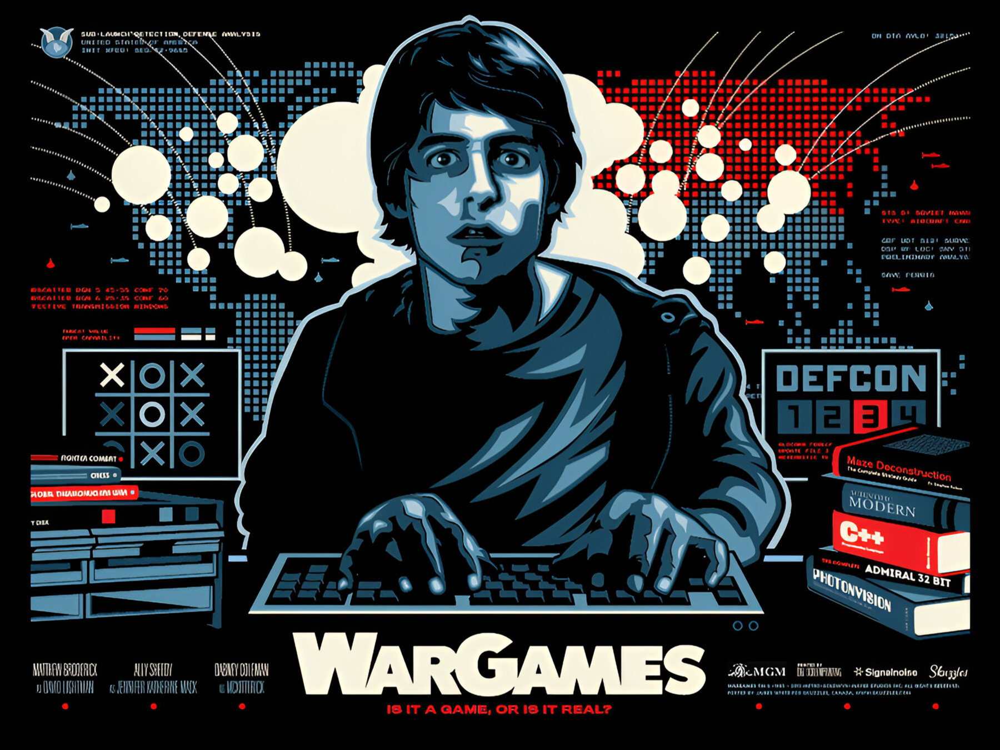

# Joshua computer from Wargames



> ## 🎮 Joshua AI Emulator
> *A WarGames-inspired AI built in C++ and SFML 3.0*

[](https://en.cppreference.com/w/)
[](https://www.sfml-dev.org/)
[](https://www.imdb.com/title/tt0086567/)
[](https://opensource.org/licenses/MIT)


---

## Table of Contents

- [About This Project](#about-this-project)
- [Features](#features)
- [Getting Started](#getting-started)
- [Demo](#demo)
- [Screenshot](#screenshot)
- [License](#license)

---

## About This Project

**Joshua AI Emulator** is my personal pet project recreating the fictional AI computer **Joshua** from the cult classic film *WarGames (1983)*.  
The goal is to replicate both the visual style of the original WOPR (Joshua) interface and its conversational logic, using **C++** and **SFML 3.0** for graphics and user interaction.

---

## Features

- Text-based conversation with the user
- Famous dialogues like *"Would you like to play a game?"*
- Simulation of military scenarios
- Console and graphical modes (via SFML)
- Interface styling inspired by the movie
- Easily extendable dialogue system

> This project is purely for educational and fan purposes and has no commercial intent.

---

## Getting Started

### Requirements

- **C++17** or higher
- **SFML 3.0**
- CMake (recommended)

### Build Instructions

Clone the repository and build:

```bash
mkdir build
cd build
cmake ..
cmake --build .
````

### Run

After building, run the executable:

```bash
./wargames_joshua
```

On first launch, a console or SFML window will appear depending on your build settings.

---

## Demo

*(Insert demo GIF here once available!)*

---

## Screenshot

*screenshots soon*

---

## License

This project is licensed under the MIT License.

> **Disclaimer:** WarGames™ and all related images, names, and characters are the property of their respective owners. This project is a fan-made recreation for educational purposes and is not affiliated with MGM, United Artists, or any related entity.

