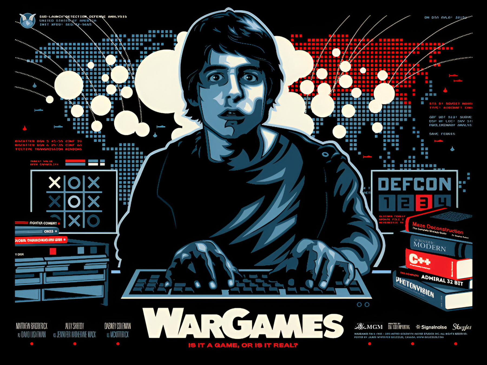

# Joshua computer from WarGames



An interactive, fan-made recreation of the **Joshua / WOPR strategy terminal** from *WarGames (1983)*. The application is written in modern C++ and SFML 3, with a GPU-based CRT display, a conversational command system, playable tic-tac-toe, and a cinematic offline strategy simulation.

> This project is an atmospheric fictional simulation. It does not connect to networks, military systems, or external services.

## What is included

- Animated WOPR boot sequence and typewriter-style terminal output
- Joshua dialogue and command parser
- Command history with Up/Down navigation and clipboard paste
- Unbeatable tic-tac-toe opponent powered by minimax
- Timed “Global Thermonuclear War” scenario that compares abstract outcomes
- Live mode, DEFCON, processor-load, and strategy-matrix indicators
- Resizable 16:10 interface with automatic letterboxing
- Screenshot capture with `F12`
- Testable, SFML-independent simulation core
- Bundled VT323 terminal font under the SIL Open Font License

## CRT display

The interface is first rendered into an off-screen SFML texture and then passed through a GLSL post-processing shader. The shader combines:

- barrel distortion and curved glass edges
- animated scanlines and a slow rolling band
- RGB phosphor triads and chromatic separation
- directional phosphor bloom
- vignette, exposure flicker, analog noise, and horizontal tearing
- stronger synchronization glitches during dramatic simulation events

Use `CRT 0` through `CRT 100` inside the terminal to adjust the effect. Press `F2` to bypass or restore the shader.

## Requirements

- A C++17 compiler
- CMake 3.22 or newer
- Ninja, Make, Visual Studio, or another CMake-supported build tool
- A GPU and driver with GLSL shader support

SFML 3.0.2 is detected automatically. If SFML is not installed, CMake downloads the pinned version from the official SFML repository.

## Build and run

### macOS or Linux

```bash
cmake -S . -B build -DCMAKE_BUILD_TYPE=Release
cmake --build build --config Release
./build/wargames_joshua
```

On macOS, SFML can optionally be installed ahead of time with Homebrew:

```bash
brew install cmake sfml
```

On Ubuntu/Debian, install the build tools first. SFML itself can be downloaded by CMake:

```bash
sudo apt install build-essential cmake ninja-build libgl1-mesa-dev \
  libx11-dev libxrandr-dev libxcursor-dev libxi-dev libudev-dev libfreetype-dev
```

### Windows

From a Developer PowerShell prompt with CMake and Visual Studio installed:

```powershell
cmake -S . -B build
cmake --build build --config Release
.\build\Release\wargames_joshua.exe
```

The `assets` directory is copied beside the executable automatically.

## Test

```bash
cmake -S . -B build -DBUILD_TESTING=ON
cmake --build build
ctest --test-dir build --output-on-failure
```

## Terminal commands

| Command | Action |
| --- | --- |
| `HELP` | Show all commands |
| `GAMES` | List strategy programs |
| `PLAY TIC-TAC-TOE` | Start a game against Joshua |
| `PLAY GLOBAL THERMONUCLEAR WAR` | Start the offline scenario |
| `STATUS` | Show system status |
| `WHO ARE YOU?` | Ask Joshua to identify itself |
| `CRT 0-100` | Adjust CRT aging intensity |
| `CLEAR` | Clear terminal history |
| `QUIT` | Disconnect and close |

During tic-tac-toe, enter a square from `1` to `9`. During the strategy simulation, use `STATUS` or `ABORT`.

## Project layout

```text
assets/
  fonts/                 Bundled VT323 font and license
  shaders/crt.frag       Analog CRT post-processing shader
src/
  Application.*          SFML window, renderer, input, and terminal UI
  JoshuaCore.*           Dialogue, games, minimax, and simulation state
  main.cpp               Application entry point
tests/
  JoshuaCoreTests.cpp    Core behavior tests without a display
```

## License and disclaimer

The source code is licensed under the [MIT License](./LICENSE). VT323 is distributed separately under the [SIL Open Font License](./assets/fonts/OFL.txt).

*WarGames* and its related names, characters, and imagery belong to their respective rights holders. This educational fan project is not affiliated with or endorsed by MGM, United Artists, or any related entity.
